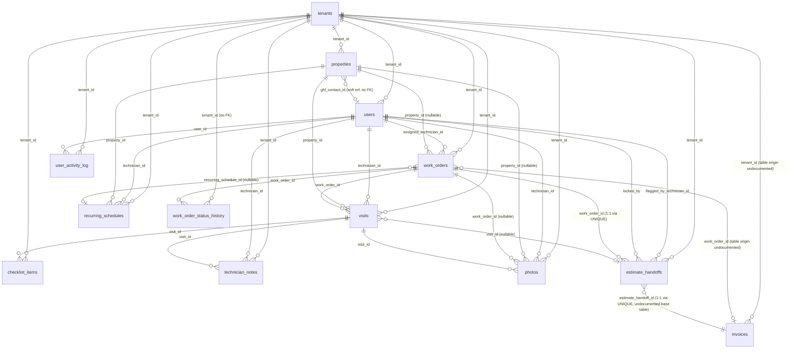

# Current-State Entity Relationship Diagram — Phase 0

_Derived from all 20 files in `supabase/migrations/` (20260506000001 through 20260617000001), read in full. Where a table's CREATE TABLE statement is not present in any migration file, this is called out explicitly — it means the table exists only because someone ran DDL by hand against the Supabase project (via the SQL Editor / dashboard), and the migrations directory alone cannot recreate the database from scratch._

## Entity relationship diagram

## Table inventory

### `tenants` (migration 20260506000002, altered by 20260513000001, 20260613000001)
Root of the multi-tenant hierarchy.

| Column | Type | Notes |
|---|---|---|
| id | UUID PK | |
| name | TEXT NOT NULL | |
| slug | TEXT NOT NULL UNIQUE | |
| ghl_location_id | TEXT UNIQUE | nullable — drives inbound webhook tenant routing |
| ghl_api_token_encrypted | TEXT | nullable; **not currently used anywhere in app code** — the real token lives in `GHL_PRIVATE_INTEGRATION_TOKEN` env var, shared across all tenants (single-tenant-in-practice deployment) |
| is_active | BOOLEAN NOT NULL DEFAULT true | |
| plan | TEXT | nullable, billing tier placeholder |
| owner_name, business_phone, business_email, service_area | TEXT | added 20260513000001 |
| last_webhook_at | TIMESTAMPTZ | added 20260513000001 |
| stripe_account_id | TEXT UNIQUE | added 20260613000001 |
| stripe_charges_enabled | BOOLEAN NOT NULL DEFAULT false | added 20260613000001 |
| stripe_onboarding_completed_at | TIMESTAMPTZ | added 20260613000001 |
| created_at, updated_at | TIMESTAMPTZ | trigger-maintained |

Seed row: `a0000000-0000-0000-0000-000000000001` ("Showtime Pool Service" / `showtime-pools`).

### `users` (migration 20260506000003, altered by 20260506000012)
All platform users, including technicians (`role = 'technician'`).

| Column | Type | Notes |
|---|---|---|
| id | UUID PK | |
| tenant_id | UUID NOT NULL FK → tenants ON DELETE CASCADE | |
| auth_provider_id | TEXT UNIQUE | legacy NextAuth mock-user linkage |
| email | TEXT NOT NULL | **UNIQUE only as `(tenant_id, email)`, not globally** — see security-audit.md §1 for the login-flow implication |
| name | TEXT NOT NULL | |
| phone | TEXT | |
| role | user_role NOT NULL DEFAULT 'technician' | enum |
| is_active | BOOLEAN NOT NULL DEFAULT true | soft-delete flag; also doubles as "invitation not yet accepted" state |
| password_hash | TEXT | added 20260506000012; nullable |
| created_at, updated_at | TIMESTAMPTZ | |

No dedicated `invitations` table exists in any migration — invite state is modeled as `users` rows with `is_active = false` and (per the API-route audit) a token embedded in the invite email, verified against columns on this same table at accept time.

### `properties` (migration 20260506000004)
Customer service locations. `pool_equipment` is a JSONB snapshot (not history).

Key columns: `tenant_id` FK CASCADE, `ghl_contact_id` (soft ref, no FK, nullable), `customer_name`, `address_line1/2`, `city`, `state CHAR(2)`, `zip`, `gate_code`, `access_notes`, `service_notes`, `pool_equipment JSONB`, `is_active BOOLEAN DEFAULT true` (soft delete).

### `work_orders` (migration 20260506000005, altered by 20260506000013, 20260514000001, 20260514000002, 20260515000003)
Core job record.

| Column | Type | Notes |
|---|---|---|
| id | UUID PK | |
| tenant_id | UUID NOT NULL FK → tenants CASCADE | |
| property_id | UUID FK → properties ON DELETE RESTRICT | **nullable since 20260506000013** |
| wo_number | INTEGER GENERATED ALWAYS AS IDENTITY | true DB-level auto-increment (not app-computed `COUNT+1`) — the one document number in the schema that is concurrency-safe by construction |
| ghl_contact_id, ghl_opportunity_id | TEXT | soft refs, nullable |
| title, description | TEXT | |
| status | work_order_status NOT NULL DEFAULT 'new' | enum: new, assigned, in_progress, completed, needs_follow_up, estimate_needed, cancelled |
| priority | priority NOT NULL DEFAULT 'normal' | enum: low, normal, high, urgent |
| service_category | service_category NOT NULL | enum, 10 values |
| assigned_technician_id | UUID FK → users ON DELETE SET NULL | |
| scheduled_date, scheduled_time_start/end | DATE/TIME | CHECK: end ≥ start |
| completed_at | TIMESTAMPTZ | |
| estimate_handoff_status | estimate_handoff_status NOT NULL DEFAULT 'not_needed' | independent state machine from `status` |
| estimate_notes | TEXT | added 20260514000002, denormalized preview copy |
| ghl_sync_failed | BOOLEAN NOT NULL DEFAULT false | |
| recurring_schedule_id | UUID FK → recurring_schedules ON DELETE SET NULL | added 20260514000001 |
| ghl_trigger_stage | TEXT | added 20260515000003, per-stage idempotency key |
| created_at, updated_at | TIMESTAMPTZ | |

**No `is_active`/soft-delete column exists on this table at all** — the only delete mechanism available is the hard `DELETE FROM work_orders` used by `deleteWorkOrder()`, which directly contradicts the project's own "soft delete only" rule (`.claude/rules/coding-standards.md`, `.claude/rules/security-rules.md` do not literally say this, but `CLAUDE.md` §11 and the Phase 5 prompt explicitly require archive-not-delete for work orders). See security-audit.md for the exploitability angle.

Unique index `idx_wo_ghl_opportunity_tenant` on `(ghl_opportunity_id, tenant_id) WHERE ghl_opportunity_id IS NOT NULL` — this is the DB-level idempotency guard for webhook-driven work order creation.

### `visits` (migration 20260506000006)
One physical service call.

Key columns: `tenant_id`, `work_order_id` FK CASCADE, `property_id` FK RESTRICT, `technician_id` FK SET NULL, `status` enum (scheduled/in_progress/completed/skipped/rescheduled/cancelled), `scheduled_date DATE NOT NULL`, `checklist JSONB DEFAULT '[]'` (live working copy), `technician_notes TEXT`, `photo_urls TEXT[]`, `completed_at`, `estimate_flagged BOOLEAN`.

Constraints: `chk_completed_at` (status='completed' requires completed_at set); unique partial index `idx_visits_one_active_per_wo` enforcing at most one non-terminal visit per work order at a time.

### `checklist_items` (migration 20260506000007) — **dead table, confirmed by module-verification pass**
Designed as normalized per-visit checklist rows, intended to complement the `visits.checklist` JSONB snapshot as "the source of truth for reporting and history" per the migration's own comment. **Zero application code references this table anywhere in `src/`** — the app exclusively reads/writes `visits.checklist` JSONB. Either wire this table up for real (Phase 5's checklist-versioning work) or drop it — it currently just sits unused.

### `technician_notes` (migration 20260506000008) — **dead table, confirmed by module-verification pass**
Designed as structured, individually-attributed note records (`tenant_id`, `visit_id` FK CASCADE, `technician_id` FK SET NULL, `body TEXT NOT NULL`). **Zero application code references this table** — the app exclusively uses the single `visits.technician_notes` plain-text column, so there is no per-note timestamp/attribution as this table's design implies. Same recommendation as `checklist_items`.

### `photos` (migration 20260506000009)
Immutable (no `updated_at`, no UPDATE policy). `tenant_id`, `visit_id` FK CASCADE, `work_order_id`/`property_id`/`technician_id` FK SET NULL (nullable), `storage_path TEXT UNIQUE NOT NULL`, `public_url`, `caption`, `taken_at`.

### `estimate_handoffs` (migration 20260506000010, altered by 20260613000001)
The estimate **flag/state-machine** layer — distinct from the (undocumented, likely non-existent) `estimates` financial-document table implied by `src/types/estimate.ts`.

| Column | Type | Notes |
|---|---|---|
| id | UUID PK | |
| tenant_id | FK CASCADE | |
| work_order_id | FK CASCADE, **UNIQUE** | one open handoff per WO |
| visit_id | FK SET NULL, nullable | |
| flagged_by_technician_id | FK SET NULL, nullable | |
| status | estimate_handoff_status NOT NULL DEFAULT 'flagged' | enum: not_needed, flagged, sent_to_ghl, estimate_sent, approved, declined |
| ghl_task_id | TEXT | |
| flagged_at, sent_to_ghl_at, estimate_sent_at, approved_at, declined_at | TIMESTAMPTZ | one-way state-transition timestamps |
| notes | TEXT | |
| accept_token | UUID, nullable | added 20260613000001 for a planned public `/estimate/[token]` page — **no application code anywhere generates, reads, or validates this column** (confirmed by repo-wide grep); the page itself does not exist |
| accept_token_expires_at | TIMESTAMPTZ, nullable | same — unused |
| locked_at | TIMESTAMPTZ, nullable | **is** used — checked by `PATCH /api/work-orders/[id]` to block further estimate-status mutation once set |
| locked_by | FK → users SET NULL, nullable | column exists, never written by any code path found |

### `recurring_schedules` (migration 20260514000001)
`tenant_id`, `property_id` FK CASCADE, `technician_id` FK SET NULL, `frequency CHECK IN ('weekly','biweekly','monthly')`, `day_of_week SMALLINT CHECK 0-6`, `time_start/end TIME`, `service_category` enum, `is_active BOOLEAN DEFAULT true`, `starts_on DATE NOT NULL`, `ends_on DATE`.

### `work_order_status_history` (migration 20260514000002)
Append-only audit log. `work_order_id` FK CASCADE, **`tenant_id UUID NOT NULL` with no FK constraint** (only table in the schema where tenant_id is un-keyed — a minor referential-integrity gap, not a security one since it's still populated correctly by the one insert site), `previous_status`/`new_status VARCHAR(50)` (plain strings, not the enum type — drift risk if the enum's value set changes), `changed_by_name TEXT`, `changed_at`.

### `user_activity_log` (migration 20260515000001)
Append-only audit log. `tenant_id` FK (no ON DELETE specified — defaults to NO ACTION), `user_id` FK (same), `action_type`, `description`, `entity_type`, `entity_id` — **no `metadata`/JSONB column**, so all structured context must be serialized into the `description` string. RLS enabled with SELECT/INSERT policies only (no UPDATE/DELETE policies — correctly immutable).

### `invoices` — **base table has no migration file**
The `invoices` table's `CREATE TABLE` statement does not exist anywhere in `supabase/migrations/`. Migration 20260613000001's own header comment confirms this: _"All target tables already exist (created via Supabase dashboard). This migration is purely additive."_ Its RLS-enabled-with-zero-policies starting state (fixed by the same migration) further confirms manual dashboard creation, as does the separate follow-up migration `20260617000001_grant_invoices_service_role.sql` needed because dashboard-created tables don't get Supabase's automatic role grants that CLI-pushed migrations do.

**Practical consequence:** if this Supabase project were ever rebuilt from `supabase/migrations/` alone (disaster recovery, new environment, CI test database), the `invoices` table — and everything Phase 15 built on top of it — would not exist. This is the single highest-priority schema-hygiene item for Phase 1/2 (see master-plan.md).

Known columns, reconstructed from `src/lib/db/queries/invoices.ts`'s `InvoiceRow` type and the 20260613000001 ALTER statements (not independently verified against `information_schema` in this phase — recommend a live schema dump before Phase 2 to confirm exact base-table columns):
`id, tenant_id, estimate_handoff_id (added), estimate_id, work_order_id, property_id, ghl_contact_id, ghl_opportunity_id, invoice_number, title, status (enum, added), customer_name, customer_email, customer_phone, customer_address, issue_date, due_date, sent_at, viewed_at, paid_at, subtotal, tax_rate, tax_amount, discount_amount, total, amount_paid, amount_due, deposit_percent (added), deposit_amount (added), deposit_required (added), notes, terms, payment_instructions, stripe_payment_intent_id, stripe_payment_link, stripe_checkout_session_id (added), public_token, created_by, created_at, updated_at`.

### `invoice_line_items` — **referenced in code, no migration, existence unverified**
`src/lib/invoicing/create-invoice-from-estimate.ts` inserts into `invoice_line_items` when line items are supplied, but:
- No migration anywhere creates this table.
- If it was created ad hoc (same pattern as `invoices`), it almost certainly has the **same missing-grants bug** that `invoices` had before migration 20260617000001 — and no equivalent grant-fix migration exists for it.
- The insert failure path is caught and only `console.error`'d, never surfaced to the caller (`create-invoice-from-estimate.ts` returns `{ outcome: 'created' }` regardless).

**This means line-item snapshots on invoices are very likely silently failing to persist right now**, with no visible symptom other than an invoice showing a total with no itemized breakdown. Recommend verifying this table's existence and grants directly in the Supabase dashboard before Phase 2 work begins (flagged as a near-term bug, independent of the Phase 2 architecture-reconciliation work).

## Enums (migration 20260506000001, plus `invoice_status` added 20260613000001)

| Enum | Values (definition order) |
|---|---|
| `user_role` | platform_owner, tenant_admin, office_staff, technician, read_only_owner |
| `work_order_status` | new, assigned, in_progress, completed, needs_follow_up, estimate_needed, cancelled |
| `priority` | low, normal, high, urgent |
| `service_category` | weekly_pool_maintenance, pool_repair, pool_inspection_diagnostic, filter_cleaning, heater_service, equipment_installation, pool_remodel, new_construction, emergency_service, other |
| `estimate_handoff_status` | not_needed, flagged, sent_to_ghl, estimate_sent, approved, declined |
| `visit_status` | scheduled, in_progress, completed, skipped, rescheduled, cancelled |
| `invoice_status` | draft, deposit_due, deposit_paid, paid, void |

## Duplicate/conflicting type definitions (flagged for Phase 2)

Two entirely separate, incompatible domain models both claim the name "Invoice":

1. **`src/types/invoice.ts`** — `InvoiceStatus` enum `{DRAFT, DEPOSIT_DUE, DEPOSIT_PAID, PAID, VOID}`, matches the real DB enum `invoice_status`, has `deposit_percent`/`deposit_amount`/`deposit_required`. This is the one actually wired to `src/lib/db/queries/invoices.ts` and `create-invoice-from-estimate.ts` — **this is the live, authoritative model.**
2. **`src/types/estimate.ts`** — a *second*, incompatible `InvoiceStatus` union `'draft'|'sent'|'viewed'|'paid'|'overdue'|'cancelled'|'refunded'` (no deposit concept at all), plus `Invoice`, `InvoiceItem`, `Estimate`, `EstimateItem`, `Payment`, `CreateEstimateInput` interfaces that reference tables (`estimates`, `invoice_items`, `payments`) with **no corresponding migrations found anywhere**. This file appears to be forward-looking scaffolding for a full estimate/invoice module that was never built — it is not imported by any live query/route code found in this audit (the estimate-handoff mechanism that *is* live uses `EstimateHandoffStatus` from `src/types/work-order.ts`, not this file).

This is exactly the "two incompatible invoice or estimate state machines" risk the Phase 2 prompt anticipates. Phase 2's schema-reconciliation task should either delete `src/types/estimate.ts`'s unused `Invoice`/`InvoiceItem`/`Payment` types outright (if truly dead) or formally absorb its `Estimate` concept into a real, migrated `estimates` table as part of the Phase 3 full-estimate work — not both files coexisting silently.

> **RESOLVED (Phase 2):** `src/types/estimate.ts` was confirmed to have zero importers and was deleted. `src/types/invoice.ts` (5-state enum matching the DB `invoice_status`) is the single authoritative invoice model. The `estimates` table/type will be designed fresh in Phase 3 on top of the pricebook + snapshot foundation. Migration `20260711000002` also added tracked baseline `CREATE TABLE IF NOT EXISTS` definitions for the previously dashboard-only `invoices`/`invoice_line_items` tables.

## Phase 2 additions (migration 20260711000002)

| Table | Purpose | Key columns |
|---|---|---|
| `document_sequences` | Tenant-scoped, transaction-safe document numbering (replaces app-layer `COUNT(*)+1`) | PK `(tenant_id, doc_type)`; `doc_type ∈ {invoice, estimate, change_order, payment}`; `next_value BIGINT`. Claimed atomically via `next_document_number(uuid, text)` — single `INSERT … ON CONFLICT DO UPDATE … RETURNING`; concurrent callers serialize on the row lock. Deny-all RLS (service_role only); EXECUTE revoked from anon/authenticated. Backfill seeds the invoice sequence above the highest already-issued `INV-*` number. |
| `pricebook_categories` | Tenant-scoped item grouping | `UNIQUE (tenant_id, name)`, `sort_order`, `is_active`, soft archive (`archived_at`), `version` (optimistic concurrency), created/updated by/at |
| `pricebook_items` | The catalog: services, labor, materials, equipment, fees, discounts, bundles | `item_type` enum `pricebook_item_type`; `customer_price`/`internal_cost` INTEGER cents; `default_quantity NUMERIC(12,3)`; `taxable`, `tax_category`, `vendor_reference`, `image_path`, `notes`, `is_active`, `sort_order`; soft archive; `version` doubles as optimistic-concurrency token and snapshot source version |
| `pricebook_bundle_items` | Bundle composition (single-level; nesting is rejected at the API layer) | `UNIQUE (bundle_id, child_item_id)`, `CHECK (bundle_id <> child_item_id)`, `quantity NUMERIC(12,3)` |

`invoice_line_items` gained snapshot columns: `unit`, `unit_cost` (cents, internal), `taxable`, `tax_category`, `discount_amount`, `markup_percent`, `source_pricebook_item_id` (FK → pricebook_items, `ON DELETE SET NULL`), `source_pricebook_version`. Line items are immutable snapshots — editing a pricebook item never mutates existing document lines (see ADR-0006).

New enum: `pricebook_item_type` = service, labor, material, equipment, fee, discount, bundle.

Pricebook RLS follows the standard pattern (select on tenant match; writes additionally require `tenant_admin`/`office_staff`/`platform_owner`) with the same "correctly designed, currently unreachable" caveat as everything else — application-layer enforcement (`requirePermission` + `tenant_id` on every query + server-side `internal_cost` redaction) is the active control.

New storage bucket: `PRICEBOOK_IMAGE_BUCKET` (default `pricebook-images`, public — catalog imagery only, no PII by design). Same dashboard-configured-ACL caveat as the other buckets.

## RLS policy summary

Every tenant-owned table has RLS **enabled**. All policies gate on `current_tenant_id()`, `current_user_id()`, `current_user_role()` — three SQL helper functions (migration 20260506000011) that resolve via `COALESCE((auth.jwt() ->> 'x')::type, current_setting('app.current_x', true))`.

**Critical caveat, confirmed by repo-wide search:** the application never uses Supabase Auth (it uses NextAuth v4 with a service-role Supabase client — see `src/lib/db/client.ts`), so `auth.jwt()` is always null in every request this app makes. The application also never calls `set_config`/executes `SET app.current_tenant_id = ...` anywhere in the TypeScript codebase. **This means all three helper functions always resolve to NULL for every query the running application ever issues, and every RLS policy in the database evaluates to `false` (deny) for the app's own traffic** — which is fine only because 100% of application queries go through the service-role client (`src/lib/db/client.ts`), which bypasses RLS entirely by design. The RLS policies are therefore not "defense-in-depth that currently does anything" — they are inert unless and until something (a future Supabase-Auth migration, or a direct anon-key script) actually populates the JWT claim or session variable. `src/lib/db/browser.ts` defines an anon-key client for exactly that future path but it has zero call sites today. Treat RLS as "correctly designed, currently unreachable" rather than "active protection" in any current-state risk assessment.

## Storage buckets

Two Supabase Storage buckets are referenced via env vars: `STORAGE_BUCKET` (job/visit photos) and `AVATAR_BUCKET=avatars` (profile pictures) plus company logos (uses the same avatars-style path convention per `settings/company/logo`). No bucket-level RLS/access-policy SQL was found in any migration — bucket privacy (public vs private, and any Storage-level RLS policies) is therefore configured entirely outside version control, directly in the Supabase dashboard, and is unverified by this audit. Recommend confirming bucket ACLs directly in Supabase before Phase 1 closes its file-security work.
