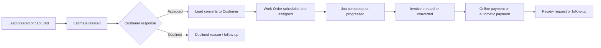
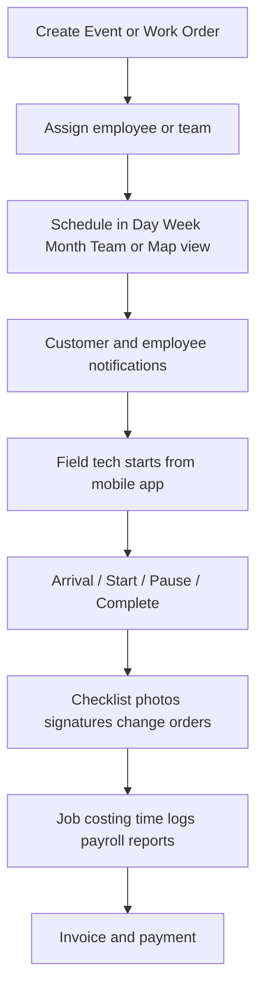

# Markate Platform Deep Research Report

## Executive summary

Markate positions itself as an **AI-powered Service Operations Platform** for field-service and home-service businesses, combining CRM, leads, estimates, scheduling, dispatch, routing, work orders, invoicing, payments, reporting, marketing, automation, mobile apps, integrations, and API access in one system rather than a stack of disconnected tools. Public official sources repeatedly frame the platform around a full operational flow from **lead capture to final payment and follow-up**, and the company says the platform is trusted by **25,000+ home service pros**. citeturn47view0turn47view2turn16search5

The most important architectural pattern in Markate is its **workflow continuity across objects**: leads can become customers, estimates can convert into invoices, work orders can be scheduled and assigned, recurring blueprints can auto-generate future work orders, change orders can extend jobs mid-stream, payments can be collected online or automatically, and review requests can be triggered after completion or payment. The platform’s public materials are unusually explicit about this being a major differentiator. citeturn15view4turn9view0turn30search2turn24view0turn26view3turn29view4

Public evidence shows a **hybrid desktop-and-mobile product** rather than a mobile companion only. Official sources describe a web app, iPhone/iPad app, Android app, customer-facing portal installable to mobile home screens, and a desktop-heavy admin surface for settings, reports, templates, connectors, and advanced setup. Some capabilities are explicitly **desktop-only** or **app-only**. For example, online payment setup, many marketing and settings tasks, and employee time-log reporting are desktop-only, while clock-in and the virtual estimator are app-focused or app-only. citeturn10view0turn39view0turn39view1turn26view3turn21view0turn22view0turn51view2

Pricing is a **base subscription plus add-ons** model, not a classic multi-tier feature ladder. Official pricing lists an **Owner Operator** base of **$49.95/month** or **$39.95/month billed annually**, plus **$5/month per additional employee**, and a wide menu of paid add-ons such as online booking, customer portal, Zapier, CompanyCam, API access, marketing blasts, NiceJob, ResponsiBid, and Kate AI. One important caveat: Markate’s own pricing page contains an inconsistency, because the hero area says annual billing saves **20%**, while the FAQ text says annual billing saves **10%** even though the stated prices reflect roughly a 20% reduction. citeturn12search14turn10view0

From a security and governance perspective, official public statements confirm **encrypted data connections**, **PCI compliance**, **API access controls**, **rate limiting**, and role-based permissions across app and web. Public sources do **not** clearly document SSO, SCIM, audit log exports, browser compatibility matrices, hosting region, cloud provider, or tenant architecture; those items should therefore be treated as **unspecified in public documentation**. citeturn10view0turn22view2turn41view0turn42view0

## Research scope and evidence quality

This report prioritizes **official Markate sources**: the main website, solution pages, pricing, integrations, developer page, API terms, product updates, and Markate Academy articles. It uses app-store listings and software directories only as supplementary evidence for mobile UX, deployment modes, and marketplace metadata. The public source base is rich enough to catalog major modules, many sub-features, a large set of admin paths, and several end-to-end workflows, but it is **not** sufficient to reverse-engineer every authenticated screen pixel-for-pixel or to confirm back-end schemas, hosting infrastructure, or every private API resource. citeturn47view0turn8view2turn8view1turn41view0turn39view0turn39view1turn40search5

A practical consequence is that this report separates claims into three evidence bands. First, **directly documented** features and flows, such as `Sales > Estimates`, `More > Connectors > QuickBooks`, recurring work-order blueprints, arrival windows, and API endpoints shown on the developer page. Second, **UI structure inferred from official help paths and screenshots**, such as top-navigation groupings, dashboard sections, or screen responsibilities. Third, **publicly unspecified** areas, which are marked explicitly rather than guessed. citeturn51view0turn51view1turn23view0turn41view0

## Product architecture and module catalog

Markate’s public materials consistently describe the platform as a unified operations layer covering customer management, sales, job execution, field operations, finance, growth, and automation. The table below consolidates the main product surface visible in official sources.

| Module | Publicly evidenced capabilities | Representative UI entry points | Evidence |
|---|---|---|---|
| CRM and customers | Customer records, service history, invoices, interactions, customer groups/sources, customer portal, contact management | `Sales > Customers`, customer profile, customer portal invite actions | citeturn13view0turn25search1turn25search10turn26view0 |
| Leads and pipeline | Lead/opportunity pipeline, follow-ups, real-time alerts, lead conversion tracking, AI receptionist lead capture | Leads pipeline, lead view, `POST /v1/leads`, lead forms | citeturn8view2turn15view0turn30search2turn30search7turn41view0 |
| Estimates and proposals | Standard estimates, options estimates, package estimates, bulk item insert, internal markups, expiry date, proposal templates, preview, submit, customer acceptance | `Sales > Estimates`, `+ New Estimate`, proposal preview, customer estimate view | citeturn51view0turn48search1turn26view2turn25search13 |
| Work orders and job management | Create work orders, assign employees, schedule, multi-day jobs, recurring work orders, checklists, change orders, job photos, change approvals, job costing | `Sales > Work Orders`, work-order view, schedule & assign, checklists, job costing | citeturn24view0turn24view1turn24view2turn24view5turn17search4turn17search15turn25search15 |
| Scheduling and dispatch | Day/week/month/team/map views, filters by employee, drag-and-drop rescheduling, blocked time, holidays, arrival windows, unscheduled panel, upcoming events, open leads on map | `Schedule`, `Schedule > Settings`, `+ Create Event`, map view, upcoming, unscheduled | citeturn23view0turn17search13turn19search17turn48search3 |
| Invoices and payments | New invoices, estimate/work-order conversion, recurring/progressive invoices, tips, ACH via Square, card-on-file via Square, invoice follow-ups, financing through Wisetack, automatic payments | `Sales > Invoices`, invoice preview, online payment setup, invoice settings | citeturn51view1turn9view1turn26view3turn17search8turn25search16 |
| Expenses and job costing | Expense tracking, recurring expenses, mileage logging, job-level profitability, labor/material/expense/overhead analysis | Expenses module, work-order job costing, reports | citeturn9view1turn15view3turn17search7turn25search15 |
| Employees, time, payroll | Employee records, notification preferences, pay type/rate, clock-in, time log reporting, payroll reports, QuickBooks Payroll sync, team chat, location tracking | `More > Employees`, mobile `More > Clock In`, payroll/time-log reports | citeturn16search1turn21view0turn22view0turn9view1turn9view2 |
| Reporting and dashboards | Winning metrics dashboard, P&L, sales tax, customer demographics, monthly/yearly closeout, sales leaderboard, payroll/time logs, lead conversions, on-time arrival report | Dashboard, `Reports`, work-order reports | citeturn9view1turn9view2turn47view3turn48search0turn48search2 |
| Marketing and automation | Email drip, SMS drip, SMS blast, email blast, postcards, ringless voicemail, promotions, ask-for-review, automated reminders and follow-ups | `Automation > Email Automations`, `Marketing > SMS Blast`, `Marketing > Voicemail Blast`, Add-ons | citeturn13view3turn50search8turn31search15turn51view3turn31search5turn50search10turn29view4 |
| Online booking and customer self-service | Booking form, payments/deposits, coupons, minimum booking prices, reserve with Google, image uploads, customer portal | Online booking settings, booking URL, customer portal | citeturn13view1turn17search2turn17search6turn48search2turn26view0 |
| Mobile and field tools | Mobile dashboard, route planner, work orders, chat, signatures, GPS navigation with Google Maps, before/after photos, offline schedule sync, virtual estimator | Mobile main menu, route planner, work order view, More screen | citeturn11view0turn43view0turn44view0turn44view2turn44view3turn23view0turn51view2turn39view1 |
| Integrations and API | QuickBooks Online, QuickBooks Payroll, Google Calendar, Google Contacts, CompanyCam, Square, Stripe, Authorize.net, PayPal, Wisetack, ResponsiBid, NiceJob, Zapier, Twilio-based number features, REST API access | `More > Connectors`, developer request form, API docs | citeturn8view1turn26view4turn29view1turn29view2turn29view3turn29view0turn41view0 |

### Inventory and pricebook interpretation

A notable nuance is **inventory**. Markate’s public documentation does **not** prominently present a stand-alone inventory or warehouse-control module with stock counts, reordering, serials, bins, or purchase orders. What is clearly documented is an **Items** model used across estimates, invoices, work orders, and credit notes, with fields for item type, price, tax, discount, cost, image, customer group, vendor, link/URL, and notes. One Markate industry page also says handymen can “track your inventory,” but the help center’s public mechanics are much closer to a **pricebook/items catalog** than to a full inventory control system. I would therefore catalog inventory as **partially evidenced through Items and cost tracking, but no standalone stock-control suite is publicly specified**. citeturn26view1turn16search10

## Interface inventory and screen map

The public UI evidence shows a fairly consistent information architecture across desktop and mobile. The platform appears to revolve around a **top-level desktop navigation** split across `Sales`, `Schedule`, `Marketing`, `More`, `Settings`, and account/profile actions, while the mobile app uses a tile-based launcher. Academy articles repeatedly reference UI paths such as `Sales > Customers`, `Sales > Estimates`, `Sales > Invoices`, `Sales > Work Orders`, `Schedule > Settings`, `More > Add-Ons`, `More > Connectors`, and `More > Employees`, which is strong evidence for the main navigation spine. citeturn25search1turn51view0turn51view1turn23view0turn16search1turn26view4


The official Markate mobile menu screenshot shows a tile launcher with **Dashboard, Route Planner, Expenses, Leads, Estimates, Invoices, Schedule, Work Orders, Customers, More**, plus a side-menu icon and Help entry. That is the clearest public screenshot of the navigation surface and is highly useful for cataloging the app-level IA. citeturn11view0

```text
Official asset URL:
https://www.markate.com/assets/images/app/public/home/markate-mobile-phone-app.png
```


The Google Play screenshots add evidence for a **dashboard/analytics view** and several field surfaces, including route planning, signatures, and chat. One screenshot shows a bar-chart dashboard, another a route-planning map, another a signature panel, and another a threaded chat UI. These do not expose every control, but they are enough to confirm the presence of reporting, route navigation, signature capture, and in-app messaging as visible first-class UI experiences. citeturn43view2turn44view0turn44view2turn44view3

```text
Official asset URLs:
https://play-lh.googleusercontent.com/5RNZUQSvLyfUqjS6wpp_pk7ifC-zJf3oD3G2OQbXbZDR7LB6HaV736wh2GIziS6duWcKIbVUCKxJ_KJVBS_Knbs%3Dw526-h296
https://play-lh.googleusercontent.com/XksjFL3bsm1OHKvvk3WaLGl4aAHbIGCR_FXLYJ2ue6crgj4WPhrQPEkAJoJ97ksvP8OKaZrlW-HOIelD6ISh%3Dw526-h296
https://play-lh.googleusercontent.com/IKx9QEE2PddA0JgPNY6OxW8b6GunGcy6rlVIKyFRAXCAtnrt0fVkwbSfsUIdB4gurvNOmPZZMOwF3eMArRK-zA%3Dw526-h296
https://play-lh.googleusercontent.com/FtxvvZvUSHMNnuQVhRnyts9LZvrdAgpi3eDIeQ0IEIp0UPGCtpsXwvKeU6LmrFKHtN--VwKp7KanaIioXdBKIA%3Dw526-h296
```

### Publicly evidenced screens and UI components

| Screen or area | Publicly evidenced UI elements | What this implies |
|---|---|---|
| Mobile home / launcher | Tile grid for Dashboard, Route Planner, Expenses, Leads, Estimates, Invoices, Schedule, Work Orders, Customers, More; hamburger; Help | Mobile is not a thin companion app; it exposes many core modules directly. citeturn11view0turn43view1 |
| Estimates dashboard | `My Estimates` dashboard, categories including Draft, Submitted, Accepted, Lost, Declined by Customer, Invoiced, Inactive, Archived; `+ New Estimate` button | Estimates have a list/dashboard layer with status segmentation and quick-create. citeturn51view0turn48search1 |
| Options estimate form | Customer selector, new customer option, job name, estimate/expiry dates, add options, bulk add, descriptions, pricing/tax, internal markup, assigned employee, proposal kit template, preview/submit | Estimate forms are multi-section documents with commercial controls and customer-facing proposal UX. citeturn48search1turn26view2 |
| Invoice form | Customer details, line items, payment terms, payment methods, drag handle for line-item order, edit after send until paid | Invoice editing supports document-style ordering and payment configuration. citeturn51view1turn26view3 |
| Work-order form / view | Items, discounts, tax, deposits, checklist section, assign-to section, schedule section, right-side assigned/schedule details, change order button, job costing view, Schedule & Assign action | Work orders act as the operational hub between sales documents and execution. citeturn24view0turn24view1turn24view5turn25search15 |
| Schedule calendar | Day, Week, Month, Team Month, Team Day, Map; filters by employees; upcoming; unscheduled; open leads; blocked events; holidays; settings; create event | Scheduling is one of the most mature and configurable parts of the product. citeturn23view0turn17search13turn19search17 |
| Schedule settings | Calendar timezone, default view, start day, working hours, event display options, arrival-window interval and calculation, display holidays, offline sync setting in app | There is a significant settings layer behind scheduling, not just a basic calendar. citeturn23view0turn19search17turn48search3 |
| Customer profile | Customer portal tab, quick stats, portal URL, activity tracking, tax-exempt field, profile view/edit | Customer objects store both operational and commerce metadata. citeturn26view0turn48search2 |
| Employee configuration | New Employee form, picture upload, role selection, calendar color, about section, notification checkboxes, pay type/rate, app permissions, web permissions, employee access/password | Employee records combine HR basics, permissions, and scheduling behavior. citeturn16search1turn21view0turn22view2turn50search6 |
| Connectors page | Connector toggles, setup/manage flows for QuickBooks, NiceJob, CompanyCam, others | Integrations are managed inside the product rather than via hidden back-office tooling. citeturn26view4turn29view2turn29view3turn28search7 |
| Templates area | Email templates tab, SMS templates tab, edit action, preview, placeholders including arrival window block | Notification content is customizable and template-driven. citeturn49search1turn49search0 |

### Official screenshot and asset links

The following public image assets were directly retrievable from official Markate or app-store pages during research.

| What it shows | Asset link | Source |
|---|---|---|
| Mobile tile launcher | `https://www.markate.com/assets/images/app/public/home/markate-mobile-phone-app.png` | citeturn11view0 |
| Google Play hero / platform summary | `https://play-lh.googleusercontent.com/OcWmf1wmoD6EchTravLRudqNSUpJMC8Jp_MyPnY8WN9ovxMncXcoo2sJCXjY-ZMluSfaiBSBphiWRcUkLTLLSg%3Dw526-h296` | citeturn43view0 |
| Dashboard chart screenshot | `https://play-lh.googleusercontent.com/5RNZUQSvLyfUqjS6wpp_pk7ifC-zJf3oD3G2OQbXbZDR7LB6HaV736wh2GIziS6duWcKIbVUCKxJ_KJVBS_Knbs%3Dw526-h296` | citeturn43view2 |
| Route-planning map screenshot | `https://play-lh.googleusercontent.com/XksjFL3bsm1OHKvvk3WaLGl4aAHbIGCR_FXLYJ2ue6crgj4WPhrQPEkAJoJ97ksvP8OKaZrlW-HOIelD6ISh%3Dw526-h296` | citeturn44view0 |
| Signature capture screenshot | `https://play-lh.googleusercontent.com/IKx9QEE2PddA0JgPNY6OxW8b6GunGcy6rlVIKyFRAXCAtnrt0fVkwbSfsUIdB4gurvNOmPZZMOwF3eMArRK-zA%3Dw526-h296` | citeturn44view2 |
| Chat screenshot | `https://play-lh.googleusercontent.com/FtxvvZvUSHMNnuQVhRnyts9LZvrdAgpi3eDIeQ0IEIp0UPGCtpsXwvKeU6LmrFKHtN--VwKp7KanaIioXdBKIA%3Dw526-h296` | citeturn44view3 |
| Solution-page scheduling asset | `https://www.markate.com/assets/images/app/public/solutions/scheduling/scheduling_video.webp` | citeturn45view0 |
| Solution-page customer portal asset | `https://www.markate.com/assets/images/app/public/solutions/customer_portal/customer_portal_video.webp` | citeturn45view2 |

## Core workflows and user journeys

Markate’s strongest public documentation is around **document-to-operations conversion**. The platform exposes a clear journey from lead creation, to estimate, to customer conversion, to work order and scheduling, to invoice and payment, with review and follow-up automation layered on top. Official sources explicitly describe automated estimate-to-work-order-to-invoice flow, estimate approval driving customer conversion, recurring work-order generation from a blueprint, and automated invoice or review communications. citeturn9view0turn30search2turn24view0turn29view4

### Lead to estimate to customer to invoice

The following workflow is directly evidenced by official help content and product pages. Estimate creation can start from the estimates module or from a lead; when an estimate created from a lead is approved, the lead automatically converts to a customer. Approved estimates can then be converted into invoices, and work orders can be scheduled and assigned in the same operational chain. citeturn30search2turn51view0turn51view1turn9view0



### Scheduling and field execution workflow

Scheduling is not just a date picker. Official documentation shows this chain: create a work order or event, assign one or many employees, set arrival-window rules, push notifications, visualize the day on calendar or map, let technicians clock in and update job states from the app, capture location pings, signatures, photos, and checklist completion, then roll time and job data into payroll and reporting. citeturn23view0turn24view0turn24view4turn21view0turn39view1



### High-value workflow patterns

| Workflow | Public behavior | Operational significance | Evidence |
|---|---|---|---|
| Lead-origin estimate | Open lead and create estimate; accepted estimate auto-converts lead to customer | Prevents duplicate entry between prospecting and sales | citeturn30search2 |
| Estimate to invoice | Approved estimate converts directly to invoice | Sales handoff to billing is native | citeturn51view1turn9view0 |
| Estimate with customer choice | Options estimate lets customer checkbox-select services; total updates dynamically | Useful for upsell/packaging without issuing multiple quotes | citeturn48search1turn26view2 |
| Recurring work-order blueprint | Blueprint defines cadence and automatically generates future work orders | Good for maintenance businesses | citeturn24view2 |
| Multi-day work order | Parent work order can split into child jobs; child jobs can be scheduled independently; combined invoicing at parent | Supports longer projects | citeturn24view0turn17search4 |
| Mid-job change order | Add items to existing work order for customer approval/signature; cannot invoice while pending | Controls scope creep and approvals | citeturn24view1turn17search15 |
| Automatic payments | Customer cards can be charged automatically; daily noon processing logic and retry limits are documented | Reduces AR follow-up for recurring or due invoices | citeturn26view3 |
| Review automation | Review requests can trigger after invoice paid or work order completed, with up to three notifications | Extends operational workflow into reputation growth | citeturn29view4 |

## Roles, permissions, data model, automation, and notifications

### Roles and permissions

Markate publicly documents five common employee roles: **Field Tech, Office Manager, Sales, Accountant, Partner**. The role model is important because Markate distinguishes **App Permissions** from **Web Permissions**. A field tech has app access only; an accountant has web access only; office manager and sales roles have both app and web access but limited desktop scope; a partner has near-full access with optional hiding of the Employee tab on web. Crucially, official documentation says app permissions do **not** automatically carry over to desktop access, so administrators must configure both surfaces separately. citeturn21view0turn22view2

| Role | Publicly documented access pattern | Notes |
|---|---|---|
| Field Tech | App only; no web access | App permissions can limit modules like customers, estimates, invoices, leads, work orders, schedule, items, expenses, chat, and more. citeturn21view0turn22view2 |
| Office Manager | App + limited web | Web scope includes schedule and sales modules such as customers, invoices, estimates, work orders, and leads. citeturn22view2 |
| Sales | App + web, similar to Office Manager | Product updates also show estimate ownership / salesperson assignment rules. citeturn21view0turn48search2 |
| Accountant | Web only | Limited to modules such as expenses, reports, and QuickBooks. citeturn22view2 |
| Partner | Full app access and near-full web access | Employee tab can optionally be hidden on web. citeturn22view2 |

Official product updates further show **role-sensitive permissions inside workflows**. For example, when assigning a salesperson to an estimate, only **Owners, Partners, and Office Managers** can change or reassign the salesperson, while Sales staff cannot self-assign estimates they did not create. citeturn48search2

### Logical data model

Markate does not publish a complete database schema in public materials, but the public UI and workflow documentation are strong enough to reconstruct a **logical domain model**. The table below is therefore an **inference from official documentation and screen fields**, not a direct vendor ERD.

| Entity | Publicly evidenced fields or behaviors | Relationship hints | Confidence |
|---|---|---|---|
| Customer | Profile, service history, invoices, estimates, portal tab, portal URL, files, tax-exempt setting, groups/sources | Parent for estimates, invoices, appointments, service requests, portal activity | High citeturn13view0turn25search1turn26view0turn48search2 |
| Lead / opportunity | Pipeline stage, follow-ups, alerts, estimate-from-lead, manual convert-to-customer, source tracking | May convert to customer; may originate from AI receptionist, contact forms, booking, external connectors | High citeturn15view0turn30search2turn31search3turn48search2turn30search7 |
| Estimate | Customer, job details, estimate date, expiry date, options/packages, items, markup, internal notes, assigned employee, status bands | Can be accepted/declined/invoiced; can convert to invoice; accepted lead estimate converts lead to customer | High citeturn51view0turn48search1turn26view2turn51view1 |
| Work order | Items, tax, deposit, assigned employees, schedule, status, checklists, change orders, job costing | Derived from or adjacent to estimates; can roll into invoice | High citeturn24view0turn24view1turn24view5 |
| Recurring work-order blueprint | Recurrence interval, end condition, employees, future-job generation | Generates future work orders | High citeturn24view2 |
| Multi-day work-order parent/child | Parent work order, child jobs, independent scheduling, combined invoicing | Supports project decomposition | High citeturn24view0turn17search4 |
| Invoice | Customer details, line items, order, payment options, payment terms, recurring/progressive schedules | Can be created directly or converted from estimate/work order; can be paid online or automatically | High citeturn51view1turn9view1turn26view3 |
| Payment | Provider, status, invoice association, automatic-payment activity, ACH, tip, financing | Syncs to QuickBooks; can be paid from invoice link or portal | High citeturn26view3turn27view0turn26view0 |
| Item | Name, description, type, price, tax, discount, cost, image, customer group, vendor, URL, notes | Reused across estimates, invoices, work orders, credit notes | High citeturn26view1 |
| Employee | Profile, picture, role, calendar color, notifications, pay type, pay rate, app/web permissions, password/access | Assigned to schedules and work orders; time logs and payroll reporting attach here | High citeturn16search1turn21view0turn22view2 |
| Schedule event | Start/end, arrival window, event color, default view, blocked time, holiday display | Can belong to work orders or standalone events | High citeturn23view0turn48search3 |
| Checklist | Name, checklist items, auto-attach rules by residential/commercial/both, completion user/time | Attached to work orders | High citeturn24view5 |
| Expense / mileage / labor | Recurring expenses, mileage log, job-costing expense and labor components | Feed job costing, payroll, P&L | High citeturn9view1turn15view3turn22view0 |

### Automation and notification rules

Automation is not a single isolated feature in Markate; it is a cross-cutting design element. Official materials document automations around lead follow-up, estimate follow-up, invoice reminders, job notifications, review requests, recurring work-order generation, e-mail drip campaigns, SMS drip campaigns, and automatic payments. Template customization is publicly documented under `Settings > Email / SMS Templates`, and arrival-window placeholders can be injected into schedule templates. citeturn13view3turn50search8turn31search15turn26view3turn49search1turn49search0

| Trigger or rule | Publicly documented action | Channel or surface | Evidence |
|---|---|---|---|
| Estimate sent / not accepted | Drip follow-up emails; customizable automation timing | Email automation | citeturn13view3turn50search8 |
| Invoice due / unpaid | Automated invoice reminders and follow-ups | Email/SMS | citeturn13view3turn9view1 |
| Invoice due and saved card / automatic payments enabled | Auto-charge daily at noon based on due-date logic; max one attempt per invoice per day, max five attempts total | Payments engine | citeturn26view3 |
| Work order completed or invoice paid | Ask-for-review request; up to three notifications; customizable templates | Email/SMS with review links | citeturn29view4 |
| Change order raised | Send for customer approval; customer can accept/decline and sign | Email/WO link | citeturn24view1turn24view3 |
| Recurring work-order blueprint saved | Future work orders generated automatically | Job engine | citeturn24view2 |
| Employee assignment | App, account, email, or SMS notifications based on preferences | App/email/SMS | citeturn21view0turn50search6 |
| Appointment or schedule creation | Automated reminders to customers and employees | Email/SMS/app | citeturn23view0turn13view1 |
| Arrival window configured | Templates can include Arrival Window Block placeholder | Email/SMS templates | citeturn49search0 |
| AI receptionist call | Lead capture + real-time notifications + transcript/call log availability | Email/text/app/account | citeturn30search7 |

## Integrations, API, security, deployment, and pricing

### Integration ecosystem

Official integrations cluster into productivity, payments, financing, booking, reviews, accounting, communications, and developer connectivity. The public list from the integrations page is supplemented by help-center FAQs that clarify how various connectors behave in practice. citeturn8view1turn26view4turn29view1turn29view2turn29view3

| Integration | Category | Publicly documented behavior | Cost if stated | Evidence |
|---|---|---|---|---|
| Google Calendar / iCal | Productivity | Exports/syncs Markate calendar to Google or iCloud; avoids double-booking and missed appointments | Included | citeturn8view1turn9view2 |
| Google Contacts | Productivity | Contacts integration; customer info can appear on caller ID | Included | citeturn8view1turn9view2 |
| CompanyCam | Field photos | Sync and attach project photos to estimates, work orders, invoices | $10/month | citeturn8view1turn9view0turn29view2turn31search11 |
| Square | Payments | Preferred payment partner; supports online, field, ACH, card-on-file, tips, instant payout | Included processor integration; some features provider-dependent | citeturn8view1turn15view1turn9view1turn26view3 |
| Stripe | Payments | Online payments | Included processor integration | citeturn8view1turn26view3 |
| Authorize.net | Payments | Online payments | Included processor integration | citeturn8view1turn26view3 |
| PayPal | Payments | Alternate checkout option; PayPal/Venmo path | Included processor integration | citeturn8view1turn15view1turn26view3 |
| Wisetack | Financing | Add customer financing to estimates; financing via Markate | Included integration; financing feature documented | citeturn8view1turn9view1 |
| QuickBooks Online | Accounting | Sync customers, invoices, services, timesheets, and payments; import/export; sync logs and errors | No extra Markate fee beyond active QBO subscription | citeturn26view4turn27view0turn27view2turn27view3 |
| QuickBooks Payroll | Payroll | Sync employee hours to QuickBooks Payroll | Included integration path | citeturn9view1turn22view0 |
| ResponsiBid | Booking / lead conversion | Booking/bidding integration; also listed as paid add-on | $10/month | citeturn8view1turn10view0 |
| NiceJob | Reviews | Sends customer info to NiceJob for review requests and campaigns | $10/month | citeturn8view1turn29view3turn10view0 |
| Zapier | Automation | Trigger/action integration with API key-based setup | $10/month | citeturn9view2turn29view1 |
| Twilio-backed virtual number / BYVN / forwarding | Communications | Business phone number, forwarding, bring-your-own number, two-way texting, chat storage, Kate AI support | Typically $10/month in pricing page; virtual-number FAQ gives region-specific pricing nuance | citeturn9view3turn30search5turn31search17 |
| Reserve with Google | Booking discovery | Customers can find/book via Google when configured | Not separately priced in public FAQ | citeturn17search6 |
| Google Maps | Field navigation | GPS navigation inside field workflows and route planner | Included in app experience | citeturn39view1turn44view0 |
| Homewyse | Estimation aid | Cost estimator available in app only | Included feature listing, availability in app only | citeturn9view2 |

### API surface and endpoint inventory

Markate exposes an approved-access REST API under its “Connect API” program. The official developer page explicitly shows an example bearer-token fetch call, product messaging around API keys and usage controls, and a small public endpoint catalog labeled **Markate REST API v1**. The open API FAQ separately says approved users receive documentation and can also review docs at the public docs site, while interactive docs are said to include OAuth flows such as authorization, token exchange, refresh, revoke, and testing. citeturn41view0turn29view0turn32search0turn38search0

| Endpoint or API surface publicly visible | Public description | Evidence |
|---|---|---|
| `GET /v1/customers` | List all customers | citeturn41view0 |
| `POST /v1/customers` | Create customer | citeturn41view0 |
| `GET /v1/jobs` | List jobs | citeturn41view0 |
| `POST /v1/jobs` | Create job | citeturn41view0 |
| `PUT /v1/jobs/{id}/status` | Update job status | citeturn41view0 |
| `GET /v1/invoices` | List invoices | citeturn41view0 |
| `POST /v1/estimates` | Create estimate | citeturn41view0 |
| `GET /v1/schedule` | Get schedule | citeturn41view0 |
| `POST /v1/leads` | Create lead | citeturn41view0 |
| `DEL /v1/leads/{id}` | Delete lead | citeturn41view0 |
| OAuth docs topics | Authorize account, get access token, refresh token, revoke access, testing | citeturn32search0turn35search0turn38search0turn36search0 |

Important API governance constraints are also explicit publicly: access is for approved customers and partners only, intended for internal business operations, not for commercial software resale; API data cannot be used for scraping, dataset creation, or AI model training; rate limiting applies; and Markate may revoke access at its discretion. The developer page references **API key authentication with access controls**, while the docs and search snippets also evidence OAuth/token flows. The coexistence of both suggests more than one auth pattern may exist across access modes or documentation layers, but the exact private implementation details are not fully specified publicly. citeturn29view0turn41view0turn42view0

### Security, authentication, and trust controls

Public official sources support the following security statements with reasonable confidence: Markate says customer data is protected with **encrypted data connections similar to those used by banks**, the platform is **PCI compliant**, and it does **not store passwords or credit-card information**. Employee login uses registered email or phone plus a password set during employee setup. API access is protected by approval, access controls, and rate limits, and there are role-based app/web permissions for internal users. Markate also added CAPTCHA to lead contact forms and retired Facebook login while retaining Google login placement on the login page. citeturn10view0turn21view0turn22view2turn41view0turn42view0turn48search2

The mobile app store listing further states, as a vendor declaration to Google Play, that the Android app shares **no data with third parties**, may collect **location, personal info and other data types**, encrypts data **in transit**, and allows users to request deletion. That statement is mobile-store metadata rather than a full architectural security paper, but it is still useful corroboration for mobile privacy posture. citeturn39view1

What public sources **do not clearly specify**: SSO, MFA/2FA, SCIM, audit-log export, SOC 2, browser-by-browser support matrix, cloud provider, data residency, hosting regions, backup RPO/RTO, WAF/CDN provider, tenancy model, or encryption-at-rest details. Those areas should be treated as **unspecified in public documentation**.

### Deployment and platform support

Official and marketplace sources consistently support a **SaaS deployment model** with **web plus mobile apps**. Markate’s own pricing page says the product is available as **mobile app and web app**; Apple lists the app for **iPhone and iPad** and notes it is “Designed for iPad”; Google Play shows support for **phone and tablet**; and Capterra lists deployment as **Web, Android, iPhone/iPad**. The Customer Portal adds a separate customer-facing install path that can be launched in any desktop browser or installed from an email link to the mobile home screen, without going through the app stores. citeturn10view0turn39view0turn39view1turn40search5turn26view0

Browser support is **not publicly enumerated**. Official sources confirm portal access from “any desktop browser,” but I did not locate a public compatibility matrix that names Chrome, Safari, Edge, or Firefox as supported versions. citeturn26view0

### Pricing and feature-difference table

Markate’s pricing is best understood as **base platform + optional paid feature switches**, rather than Silver/Gold/Enterprise tiers. The table below organizes the most important public pricing differences.

| Commercial element | Public price | What it changes | Evidence |
|---|---|---|---|
| Owner Operator base | $49.95/month | Core platform subscription | citeturn12search14turn10view0 |
| Owner Operator annual | $39.95/month billed yearly, $479.40 total | Same platform, lower effective monthly cost | citeturn12search14turn10view0 |
| Additional employee | $5/month per active employee | Adds team access | citeturn9view1turn10view0 |
| Employee app access | $5/employee/month | Explicitly documented under employee management | citeturn9view1 |
| Online booking | $10/month | Booking form, booking URL, 24/7 online bookings | citeturn9view0turn13view1 |
| Branded customer portal | $10/month | Portal, branded self-service experience | citeturn9view2turn26view0 |
| CompanyCam integration | $10/month | Photo-sync connector | citeturn9view0turn29view2 |
| Zapier integration | $10/month | No-code app automation | citeturn9view2turn29view1 |
| Winning sales proposal templates | $10/month | Proposal-kit / template add-on | citeturn9view0 |
| Automated website lead capture form | $10/month | Contact-form automation | citeturn8view2 |
| NiceJob integration | $10/month | Automated review/reputation workflow | citeturn10view0turn29view3 |
| ResponsiBid booking integration | $10/month | Booking/bid connector | citeturn10view0 |
| Business phone number via Markate | $10/month | Virtual SMS number via Twilio | citeturn9view3 |
| Call forwarding | $10/month | Forward virtual number to business line | citeturn9view3 |
| Bring your own business number | $10/month | Use existing number via Twilio integration | citeturn9view3 |
| API & developer access | $50/month | Connect API | citeturn9view3turn29view0 |
| Kate AI Receptionist | $1/call | AI receptionist / lead capture | citeturn8view2turn30search7 |
| SMS drip | $0.10 per SMS in pricing page language; separate Academy notes on segmentation | Automated text follow-ups | citeturn9view0turn31search15 |
| SMS blast | $10 setup + $0.05 per SMS segment | Broadcast marketing | citeturn9view3turn51view3 |
| Email blast | $10 per 2,000 emails | Broadcast marketing | citeturn9view3 |
| Postcards on demand / Customer Finder 360 | $1.10 per jumbo postcard | Direct mail and neighborhood targeting | citeturn9view3turn31search5 |
| Ringless voicemail blasts | $10 setup + $0.20/voicemail | Broadcast voicemail marketing | citeturn9view3turn50search10 |
| Ask for Review | $10/month | Automated review requests | citeturn9view3turn29view4 |

A final caution on pricing: Markate’s pricing page hero says annual billing saves **20%**, but the FAQ says **10%**, while the actual numbers imply about **20%**. The safest reading is that the listed prices themselves are more reliable than the prose savings percentage. citeturn12search14turn10view0

## Bottom-line assessment

From public evidence alone, Markate is best understood not as a lightweight invoicing app, but as a **workflow-centric field-service operations system** with unusually broad coverage for small and midsize service businesses: CRM, lead management, estimate engineering, dispatch, route-aware field execution, work-order control, invoicing, payments, reporting, customer self-service, and multichannel marketing all sit inside the same operating model. Its strongest public differentiators are the **estimate-to-work-order-to-invoice continuity**, the **mobile-first field surface**, the **add-on commercialization model**, and the increasingly visible **API and AI layers**. citeturn47view0turn15view4turn39view1turn41view0turn30search7

The best-documented parts of the platform are scheduling, work orders, estimates, employee roles, payments, and connectors. The least transparent public areas are infrastructure/hosting, private API breadth, deep security architecture, and exact browser support. For an implementation or procurement decision, those unspecified areas would be the main candidates for direct vendor questioning. citeturn23view0turn24view0turn22view2turn26view3turn42view0